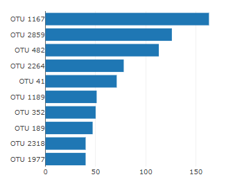
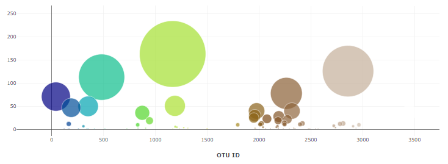
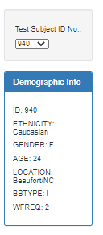
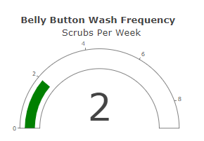

# Belly Button Biodiversity

In this assignment, I built an interactive dashboard to explore the [Belly Button Biodiversity dataset](http://robdunnlab.com/projects/belly-button-biodiversity/), which catalogs the microbes that colonize human navels.

The dataset reveals that a small handful of microbial species (also called operational taxonomic units, or OTUs, in the study) were present in more than 70% of people, while the rest were relatively rare.

## Top 10 OTUs 

This horizontal bar chart displays the top 10 OTUs found in the individual picked from the dropdown menu.

## OTU Sample Data

The generated bubble chart displays all sample values and OTU id's. 

## Demographics 

The side panel displays the sample metadata, i.e., an individual's demographic information.

## Weekly Washing 

The following is a plot of the weekly washing frequency of the individual selected. 

### About the Data

Hulcr, J. et al.(2012) _A Jungle in There: Bacteria in Belly Buttons are Highly Diverse, but Predictable_. Retrieved from: [http://robdunnlab.com/projects/belly-button-biodiversity/results-and-data/](http://robdunnlab.com/projects/belly-button-biodiversity/results-and-data/)

- - -

© 2021 Trilogy Education Services, LLC, a 2U, Inc. brand. Confidential and Proprietary. All Rights Reserved.
